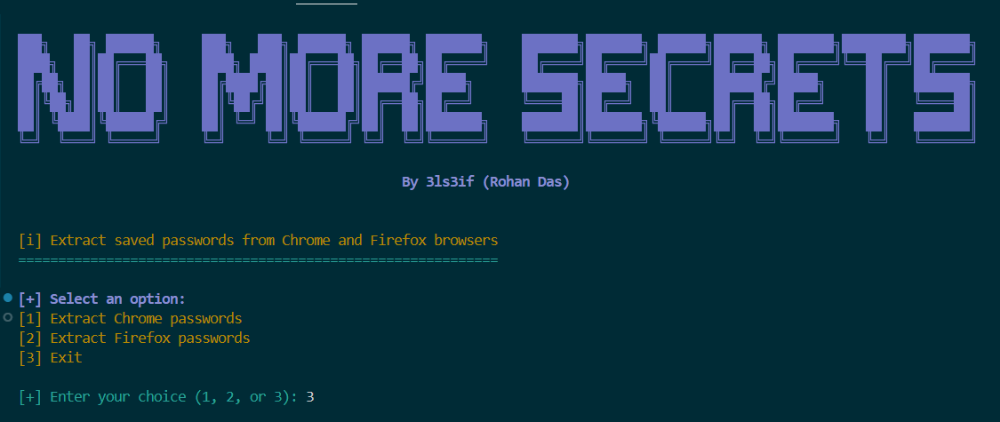

# Forensics-Credential-Harvester
Forensics Credential Harvester is a cross-platform tool for digital forensics professionals to extract and recover browser credentials from popular web browsers (Chrome, Firefox, Safari, Brave, and Internet Explorer).



## Table of Contents
- [Features](#features)
- [Disclaimer](#disclaimer)
- [Requirements](#requirements)
- [Installation](#installation)
- [Usage](#usage)
- [License](#license)

---

## Features
- Extract saved passwords from **Chrome** and **Firefox**.
- View passwords in a structured format with colored output.
- Cross-platform support (Windows, Linux, macOS).
- Interactive menu with ASCII banner for easy navigation.

---

## Disclaimer
**This tool is designed for educational and lawful purposes only. Unauthorized use of this tool to extract data from systems you do not have permission to access is illegal and unethical. Use responsibly.**

---

## Requirements
This tool requires the following:
- **Python 3.6+**
- **Google Chrome** and **Mozilla Firefox** installed (with saved passwords)
- **Colorama** package for colored output on the command line

---

## Installation

1. **Clone the Repository**
    ```bash
    git clone https://github.com/your-username/password-extraction-tool.git
    cd password-extraction-tool
    ```

2. **Install Dependencies**
    Install the required Python packages by running:
    ```bash
    pip install -r requirements.txt
    ```

3. **Install Browser Dependencies**
    - Make sure Chrome and Firefox are installed on your system.
    - Allow access to the profiles folder where saved passwords are stored (this tool needs read permissions).

---

## Usage

### Running the Tool

1. **Navigate to the project directory**:
    ```bash
    cd password-extraction-tool
    ```

2. **Run the main script**:
    ```bash
    python main.py
    ```

### Options Menu

After starting the tool, you will see a banner and a menu with options:
1. **Extract Chrome passwords**: Fetches and displays saved passwords from Chrome.
2. **Extract Firefox passwords**: Fetches and displays saved passwords from Firefox.
3. **Exit**: Exits the tool.

#### Example Usage

```
███╗   ██╗ ██████╗     ███╗   ███╗ ██████╗ ██████╗ ███████╗    ███████╗███████╗ ██████╗██████╗ ███████╗████████╗███████╗
████╗  ██║██╔═══██╗    ████╗ ████║██╔═══██╗██╔══██╗██╔════╝    ██╔════╝██╔════╝██╔════╝██╔══██╗██╔════╝╚══██╔══╝██╔════╝
██╔██╗ ██║██║   ██║    ██╔████╔██║██║   ██║██████╔╝█████╗      ███████╗█████╗  ██║     ██████╔╝█████╗     ██║   ███████╗
██║╚██╗██║██║   ██║    ██║╚██╔╝██║██║   ██║██╔══██╗██╔══╝      ╚════██║██╔══╝  ██║     ██╔══██╗██╔══╝     ██║   ╚════██║
██║ ╚████║╚██████╔╝    ██║ ╚═╝ ██║╚██████╔╝██║  ██║███████╗    ███████║███████╗╚██████╗██║  ██║███████╗   ██║   ███████║
╚═╝  ╚═══╝ ╚═════╝     ╚═╝     ╚═╝ ╚═════╝ ╚═╝  ╚═╝╚══════╝    ╚══════╝╚══════╝ ╚═════╝╚═╝  ╚═╝╚══════╝   ╚═╝   ╚══════╝

                                                By 3ls3if (Rohan Das)

    
[i] Extract saved passwords from Chrome and Firefox browsers
============================================================

[+] Select an option:
[1] Extract Chrome passwords
[2] Extract Firefox passwords
[3] Exit

[+] Enter your choice (1, 2, or 3): 3

```

- Selecting Option 1: Extracts and displays Chrome passwords.
- Selecting Option 2: Extracts and displays Firefox passwords.
- Selecting Option 3: Exits the program.


---

## License
This project is licensed under the Apache 2.0 License. See the LICENSE file for details.

